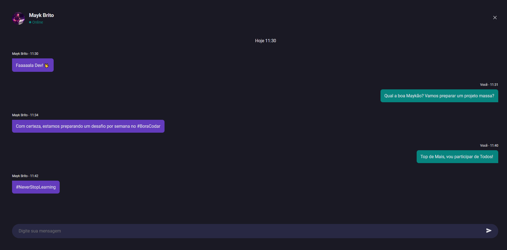

# Rocket Chat

Rocket Chat is a little project to praticle frontend skills.

### Stacks used

  

### In this Project, we used

- Responsivity
- Flexbox
- Variables
- And Others

### Functions

Under building...

## Demonstração

## Deploy

To deploy this project click on the link

  <a href="https://chrishenderson07.github.io/Rocket-Chat/">
  Deploy Project
  </a>

